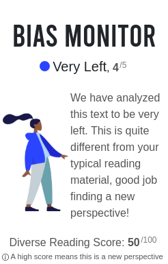
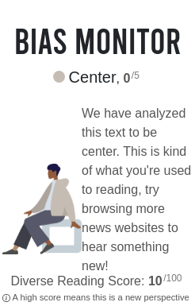
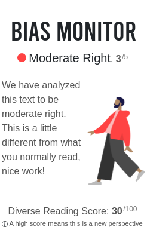

# Bias Monitor Chrome Extension
<p align="center">
    <a href="https://github.com/Alex0Blackwell/bias-monitor">
        
    </a>
</p>

<p align="center">
  <a href="#overview">Overview</a>
  &nbsp;&nbsp;&nbsp;|&nbsp;&nbsp;&nbsp;
  <a href="#developer-guide">Developer Guide</a>
  &nbsp;&nbsp;&nbsp;|&nbsp;&nbsp;&nbsp;
  <a href="#artificial-intelligence">Artificial Intelligence</a>
</p>

## Overview
*Bias Monitor* is a Chrome extension that detects the political bias
of news articles. Using Natural Language Processing (NLP) a machine
learning algorithm analyzes the context of the website content. The
algorithm determines the political bias of the website, and the
Chrome extension displays this information for the user to see.  

The extension also remembers what your viewing habits are and
what your own political bias is. Bias Monitor learns about the
type of political content you are used to seeing and encourages
viewing news sources of a conflicting perspective.

## Example
<p align="center">
  
  &nbsp;&nbsp;&nbsp;&nbsp;&nbsp;&nbsp;
  
  &nbsp;&nbsp;&nbsp;&nbsp;&nbsp;&nbsp;
  
</p>

## Developer Guide
To contribute to this project, create a pull request against the
`main` branch. One of the owners of the project will review the
request and determine if it may be merged. See the
[CONTRIBUTING.md] file for further reading.

### Environment Set Up
Download the repo and follow the
[Getting Started](https://developer.chrome.com/docs/extensions/mv3/getstarted/)
documentation on the *Chrome Developers* website.
When loading the unpacked chrome extension, specify the `dist`
folder. To develop on the project, you must use the `dev`
environment. The dev environment returns mock responses and does
not hit the API. Create a `config.js` file in the project
root directory with the following pattern:
```js
// config.js
module.exports = {
  environment: "dev",
  api_url: "<your-api-url-endpoint-here>",
  api_key: "<your-api-key-here>",
}
```
Since neither the API URL nor the API key is public, they
do not need to be specified and mock responses will be returned.

## Artificial Intelligence
### AI Overview
*Bias Monitor* uses a Machine Learning (ML) algorithm to determine the political lean of text input. More specifically, the area of ML this algorithm is concerned with is Natural Language Processing (NLP). To create the algorithm, labelled data was used. That is data that acts as input and correlates to a "bias value" indicating its political lean. By minimizing the difference between the actual bias value the ML algorithm produced and the expected value provided by the labelled data, the program can—in a sense, learn.

### Datasets
To train the AI, labelled data is required. Three different labelled
datasets were used in the training process. The first dataset came
from a pre-labelled collection of articles from
[AdFontesMedia](https://adfontesmedia.com/), providing approximately
1200 entries, totalling about 1 million words. The data was labelled
from -42 to 42, representing far left to far right respectively.  

Other datasets were created by piping data through
[Media Bias Fact Check](https://mediabiasfactcheck.com/).
The Media Bias Fact Check website analyzes data and gives a left
or right political lean. About 10 thousand articles were labelled
and trained on using this method.  

A third data source was gathered from
[All The News](https://www.kaggle.com/snapcrack/all-the-news),
a Kaggle dataset consisting of about 100 thousand articles
labelled based on political lean.

### Model Layout
The API takes in text data, analyzes it, and returns a number in
the domain of [-42, 42]; a more negative number represents further
left politically, and a greater positive number corresponds to a
far-right political lean.

### Determining a Best ML Model
The two main architectures used in finding the best model were
Long Short-Term Memory (LSTM) and Bidirectional Encoder
Representations from Transformers (BERT). LSTM is what lays
underneath
[ULMFiT](https://docs.fast.ai/tutorial.text.html#The-ULMFiT-approach)
which was used to train one model.
[BERT](https://github.com/google-research/bert) is another neural
network learning approach used in determining the best model.
[RoBERTa](https://pytorch.org/hub/pytorch_fairseq_roberta/)
is a branch off of BERT and proved to provide the best
results of all the ML models considered.  

ReBERTa achieved the best Margin Absolute Error (MAE) of
6.04.

### Further Reading and Credit
Thanks to the
[wonderful report](https://www.thebipartisanpress.com/politics/calculating-political-bias-and-fighting-partisanship-with-ai/)
by [The Bipartisan Press](https://www.thebipartisanpress.com/)
and for providing an API endpoint for our Chrome extension
project *Bias Monitor*.
